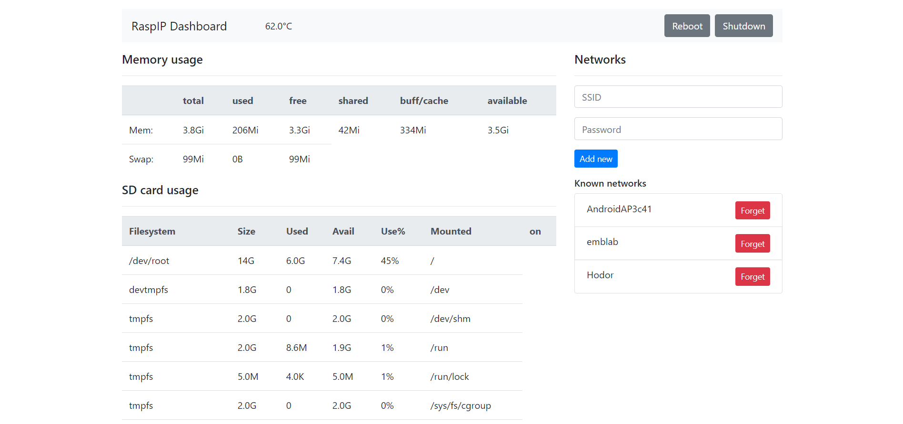

# RaspIP Dashboard
### Extension for [RaspIP](https://github.com/triihim/RaspIP])



## Setup
1. Clone this repository
2. Run npm install in RaspIP_Dashboard folder
3. Allow write access to wpa_supplicant 
    ```
    sudo chmod 777 /etc/wpa_supplicant
4. Add RaspIP_Dashboard to /etc/rc.local
    ```
    cd /path/to/RaspIP_Dashboard/src
    node RaspIP_Dashboard_app.js 

- Default port for the dashboard is 3000
